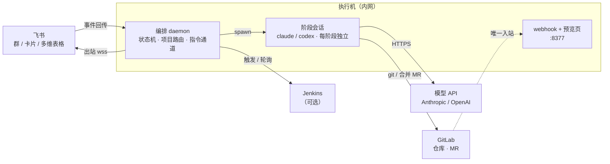

# pipeline-orchestrator

> **English summary** — A self-hosted orchestrator that turns a Feishu (Lark) group chat into the entry point of a full software-delivery pipeline driven by headless coding agents. A ticket goes through clarify → plan → implement → independent review → CI → acceptance → release → knowledge compounding; humans appear only at explicit decision gates rendered as chat cards. Agents (Claude Code, Codex CLI) execute stages under a strict JSON contract; a 198-line pure-function state machine routes between stages; every artifact is committed to git. Runs entirely on an intranet host — all connections are outbound except one webhook port. Chinese-first documentation; the code comments cite the real incidents that shaped each rule.

飞书群 + Claude Code / Codex 的开发流水线编排器。业务需求从群里进来，经**澄清 → 计划 → 实现 → 独立评审 → CI → 验收 → 上线 → 知识沉淀**走完全程；人只在需要判断的地方出现，以卡片形式做决策。全部组件跑在一台内网执行机上。

它不是"AI 替代开发"。它把开发流程里机器能做好的部分（执行模型）交给智能体，再把人留下来的那几个判断时刻（决策模型）认真设计成可点击、可追溯、不可绕过的卡点。理念与实现细节见两篇配套文章：

- 理念：[搭建自己的 Agent Harness 环境](https://kakaclo.gitbook.io/kakclo-open-wiki/da-jian-zi-ji-de-agent-harness-huan-jing)
- 实现：Harness 落地实现（见 [`docs/architecture.md`](docs/architecture.md)）

---

## 它长什么样



箭头是连接发起方向。除 8377 端口外全部出站，因此**不需要公网 IP、域名或内网穿透**。

**一张工单的真实旅程**（LS-014，10 次会话，$34，不到 5 小时，人出现 6 次）：

```
09:57  人  在群里贴一段排查结论 → 建单
10:07  机  澄清：查过代码后提 3 个业务问题（卡片）
10:12  人  答 3 题
10:22  机  澄清定稿 + 生成结果预览页 → PRD 确认卡
10:28  人  看预览 → 通过
10:41  机  计划完成 → 计划审批卡
10:43  人  通过
11:51  机  实现完成（分 2 批，子代理分层），建 MR
12:55  机  Codex 独立评审 → PASS，验收标准 14/14
15:01  机  验收自动项跑完 → 6 个人工验收项（卡片）
15:07  人  在测试环境实测 → 全部通过
15:10  机  拉 master 最新代码干跑合并 → 无冲突 → 上线审批卡
15:11  人  通过        机  3 秒后经 API 合并 MR
15:18  机  交付文档归档 + 3 条知识 + 4 条术语 → 闭环
```

## 核心设计（一分钟版）

| 设计 | 一句话 | 在哪 |
|---|---|---|
| **四态契约** | 每个阶段只能返回 `DONE / DONE_WITH_CONCERNS / NEEDS_CONTEXT / BLOCKED`，评审另有正交的 `verdict`；用 JSON Schema 约束并回程校验 | [`pipeline-plugin/schemas`](https://github.com/AndsGo/pipeline-plugin/tree/main/schemas)、`src/schema.ts` |
| **纯函数状态机** | 全部路由决策在 198 行无 IO 的 `route()` 里；回环上限（评审打回 ≤2 轮）写在代码里而不是流程图上 | `src/machine.ts` |
| **工件交接，不续会话** | 阶段间靠提交进 git 的交接文档（机器头 + 六节人类体）传递；独立评审禁止读实现记录 | `docs/pipeline/<工单>/` |
| **人的六种表达** | 点按钮、打字回答、群里下指令、`/run` 单次执行、聊完即建单、结果预览页 | `src/feishu/`、`src/daemon/handlers/` |
| **项目流程约定** | 每个仓库一份 `docs/pipeline/PIPELINE.md`：有无测试环境、谁验收、怎么上线、用哪个引擎——改流程不改代码 | `src/profile.ts` |
| **引擎抽象** | Claude 原生 + Codex 桥接，按阶段选；用另一家模型做独立评审对冲非确定性 | `src/engine/` |
| **可测** | 外部效应可注入 + "人"是四方法接口 → 35 个测试文件，含跑完整循环的集成夹具 | `src/__tests__/` |

## 快速开始

**前置**：Node ≥ 20；`claude` CLI 已登录并在 PATH；一个飞书自建应用（机器人 + 长连接事件订阅）；[`pipeline-plugin`](https://github.com/AndsGo/pipeline-plugin) 与本仓库平级 clone（或设 `PIPELINE_PLUGIN_DIR`）。

```bash
git clone https://github.com/AndsGo/pipeline-orchestrator.git
git clone https://github.com/AndsGo/pipeline-plugin.git
cd pipeline-orchestrator
npm install
cp .env.example .env          # 至少填 FEISHU_* 三项 + PIPELINE_PROJECTS
npx tsx scripts/doctor.ts     # 体检：依赖 / 配置 / 连通性一眼看清哪里断了
```

启动 daemon（自带单实例检查、日志轮转、启动核实）：

```bash
scripts/start-daemon.sh        # Linux / macOS
.\scripts\start-daemon.ps1     # Windows
```

然后在飞书群里 @机器人：

```
/new 给 /mcp 端点加限流
```

它会分诊、澄清、弹卡片问你。完整步骤见 [`docs/getting-started.md`](docs/getting-started.md)。

## 文档

| 想做什么 | 看哪里 |
|---|---|
| 从零跑通第一张工单 | [docs/getting-started.md](docs/getting-started.md) |
| 我是团队成员，怎么用 | [ONBOARDING.md](ONBOARDING.md) |
| 全部群内指令与脚本 | [docs/commands.md](docs/commands.md) |
| 环境变量与 `PIPELINE.md` 全部开关 | [docs/configuration.md](docs/configuration.md) |
| 架构、契约、状态机、交接、引擎 | [docs/architecture.md](docs/architecture.md) |
| 部署、看门狗、升级、日志、备份 | [docs/operations.md](docs/operations.md) |
| 出问题了 | [docs/troubleshooting.md](docs/troubleshooting.md) |
| 参与开发 | [CONTRIBUTING.md](CONTRIBUTING.md) |
| 安全与凭据 | [SECURITY.md](SECURITY.md) |
| 版本历史 | [CHANGELOG.md](CHANGELOG.md) |

## 仓库结构

```
src/
├── daemon.ts            常驻进程：飞书长连接、消息循环、装配
├── daemon/              指令处理器（一命令一文件，注册表按类型穷举）、单次执行、开机巡检、生命周期
├── ticketRunner.ts      单工单主循环（回退 → 挂起 → 卡点 → 上线 → 跑阶段 → 路由落账）
├── run/                 主循环的各环节：卡点、上线、动作分发、开工准备、挂起处置、快车道、沉淀
├── machine.ts           状态机（纯函数）
├── engine/              执行引擎：Engine 接口、claude 原生、codex 桥接
├── feishu/              飞书端口：卡片、回调归位、引用展开、话题、在线表
├── bitable/             多维表格看板投影、知识库、术语表
├── gitlab/              MR 评论评审服务、结果预览页、合并接口
├── profile.ts           PIPELINE.md 项目流程约定
├── runner.ts            起 headless 会话（参数、白名单、schema、预算）
├── schema.ts            契约：给模型的扁平版 / 回程校验的完整版
├── events.ts            append-only 事件流（看板、/status、断点恢复的事实源）
├── followup.ts          /run 续聊：结果卡 ↔ 会话映射、按群指针
├── jenkins.ts           CI 阶段（编排器原生，不花 LLM）
└── __tests__/           35 个测试文件，含 runTicket 集成夹具
scripts/                 运维与一次性工具（体检、接入项目、看板建表、评估集、看门狗）
config/pipeline-settings.json   headless 会话的 --settings：禁用会抢流控的元框架层
docs/                    文档与设计稿
```

## 状态与边界

- **生产在用**：三个项目、15+ 张真实工单闭环、约 $550 模型成本（2026-08 至 09）。
- **三平台**：daemon 本体与测试跨平台；启动、看门狗、webhook、工单脚本各有 PowerShell 与 bash 两版（`scripts/*.ps1` / `scripts/*.sh`）。生产执行机是 Windows，bash 版在 Ubuntu 上按功能逐项验证过，尚未长期跑生产。
- **单实例**：飞书长连接一个应用只能一条，daemon 必须单实例；多工单并行靠单进程内的异步任务 + git worktree 隔离。
- **交互层绑定飞书**：`InteractionPort` 是四方法接口，换聊天平台需要新写一个实现（已有 CLI 与自动放行两个非飞书实现可参考）。
- **状态是本地文件**：`data/` 下 JSON + jsonl，无数据库，不做多机高可用。

## 相关仓库

- [**pipeline-plugin**](https://github.com/AndsGo/pipeline-plugin) — 阶段 skill 与契约 schema。本仓库负责"下一步跑什么"，它负责"每一步怎么干"。两者通过 `schemas/stage-result.schema.json` 与 `skills/_shared/handoff-spec.md` 耦合，独立版本。

## 许可

[MIT](LICENSE)
