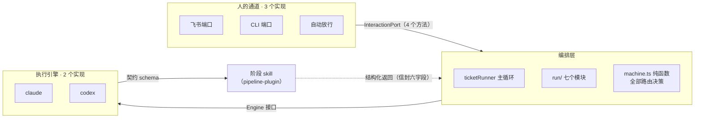

# 架构

这份文档回答"它是怎么搭的"。理念层面的论证（为什么要把决策模型和执行模型分开）见 [搭建自己的 Agent Harness 环境](https://kakaclo.gitbook.io/kakclo-open-wiki/da-jian-zi-ji-de-agent-harness-huan-jing)，这里不重复。

## 1. 四层

| 层 | 组成 | 负责什么 | 不负责什么 |
|---|---|---|---|
| **交互层** | 飞书群（主群 + 每项目一个专属群）、互动卡片、群消息指令、话题 | 把人的判断接进流程：选项按钮、打字回答、审批卡点、结果预览页、进度推送 | 不做流程决策 |
| **编排层** | 状态机、事件日志、项目流程约定、成本台账、上线环节 | 决定下一步跑什么：四态路由、回环计数与上限、人工卡点、断点恢复 | **不写业务代码** |
| **执行层** | pipeline-plugin 的阶段 skill，由 headless 会话调起 | 真正干活：读代码、写 PRD、出计划、改代码跑测试、独立评审、验收、沉淀 | 不做流程决策；"问人"只能以 `NEEDS_CONTEXT` 返回 |
| **基础设施层** | GitLab、Jenkins、目标仓库、飞书多维表格与知识库 | 代码托管、构建部署、看板、归档 | 流水线以 REST 接入，不改动它们的工作方式 |

编排层永远不碰业务代码，执行层永远不做流程决策。这条边界让状态机可以是纯函数，也让任何一个阶段能被单独调起调试。

## 2. 三条接缝



- **换聊天工具不动流程**：`src/ports.ts` 的 `InteractionPort` 只有 `askQuestions / confirmGate / notify / sendReport?`。
- **换模型不动决策**：`src/engine/types.ts` 的 `Engine` 只有 `runStage / runText`，两者都返回同一形状的信封。
- **换阶段能力不动编排**：skill 是 Markdown，改完不用重启。

## 3. 契约

编排器与阶段会话之间只有一份 JSON Schema（`pipeline-plugin/schemas/stage-result.schema.json`）。必填四项：`stage`、`status`、`handoff_path`、`summary_for_card`。状态四态：

| 状态 | 含义 | 编排器动作 |
|---|---|---|
| `DONE` | 完成 | 推进 |
| `DONE_WITH_CONCERNS` | 完成但有疑虑 | 推进，疑虑附到下一个人工卡点 |
| `NEEDS_CONTEXT` | 缺信息 | 渲染问题卡，答完**重跑同一阶段** |
| `BLOCKED` | 信息齐全但有障碍 | 挂起转人工 |

评审与验收另有正交的 `verdict`（`PASS / PASS_WITH_SUGGESTIONS / BLOCK`）："评审顺利完成、结论是阻断"是 `status: DONE` + `verdict: BLOCK`。

五条 `if/then` 条件约束把"你必须交代清楚"变成会被程序拒收的硬约束：完成态的评审必填 `verdict` 与 `axes`；`NEEDS_CONTEXT` 必带 ≥1 个问题；`BLOCKED` 必带理由；`DONE_WITH_CONCERNS` 必带 ≥1 条疑虑。

**宽进严出**：模型侧的结构化输出接口不支持顶层 `allOf`，所以给模型的是剥掉条件约束的扁平版（`wireSchema()`），回程用完整版校验（`validateResult()`）。两者在 `src/schema.ts`。

## 4. 状态机

`src/machine.ts` 的 `route(state, result) → Action` 是全部路由决策所在，198 行，无 IO。六种动作：

| 动作 | 触发 | 后续 |
|---|---|---|
| `run` | 阶段 DONE，按 `NEXT` 表推进 | 跑下一阶段 |
| `ask` | `NEEDS_CONTEXT` | 渲染问题卡 → 答案回填工件 → 重跑本阶段 |
| `gate` | clarify / plan 完成；配了 CI 时 review 通过 | 弹审批卡并落盘 → 等人裁决 |
| `fix` | review / acceptance 的 `verdict: BLOCK` | 回 implement 带 `fix=<评审报告路径>`，计数 +1 |
| `halt` | `BLOCKED`、回环到顶、阶段错位 | 挂起转人工 |
| `done` | compound 完成 | 闭环 |

止损写在代码里：`FIX_ROUND_CAP = 2`，评审打回超过两轮直接 `halt`。既往 BLOCK 未经修复轮就通过的，会在放行卡上追加警示（LS-012 的教训）。

## 5. 工件交接

每个阶段是一次全新会话，上下文不继承。阶段间传递的是提交进 git 的交接文档（`docs/pipeline/<工单>/`），每份都是**机器头 + 六节人类体**：

```yaml
---
ticket: LS-014
stage: clarify
status: DONE_WITH_CONCERNS
inputs: [00-intake.md, 05-knowledge-hints.md, 07-project-profile.md, …]   # 可审计
next_stage_reads: [10-prd.md, 93-terms.json]                              # 下游必读
---
## 本阶段结论
## 关键决策及理由
## 事实 vs 假设
## 失败过的尝试
## 阻塞与开放问题
## 给下一阶段的指令
```

三条理由：搬运会话记录会把噪音和错误路径一起继承；**独立评审必须看不到实现过程**（评审 skill 禁止读 `ledger.md` 与实现报告，自己跑测试）；只有落成文件的决策才可追溯。

例外：`/run` 单次执行的续聊是真续会话（`--resume`），成本约为拼接的十分之一。判据：同一件事继续做，续会话；换一个角色重新做，写文件。

## 6. 编排器注入给会话的东西

每个阶段开工前，编排器往工单目录放：

| 文件 | 来源 | 作用 |
|---|---|---|
| `05-knowledge-hints.md` | 知识库按需求文本相关度预取 | 历史踩坑提示；会话核实到过时可回报 `stale_hints` |
| `06-glossary.md` | 项目术语表 | PRD 与文案用语以此为准 |
| `07-map-hint.md` | 能力地图新鲜度（落后多少提交、哪些能力已变） | 地图可以旧，但不许假装新 |
| `07-project-profile.md` | `PIPELINE.md` 的「全阶段 + 本阶段」节选 | 项目事实优先于通用流程 |
| `feedback.md` | 人的驳回理由、需求变更、补充说明 | 具有约束力的人工指令，优先于旧结论 |

## 7. 执行引擎

`src/engine/`：

- **claude**（原生）：`claude -p '/pipeline-<stage> <ticket>' --plugin-dir … --settings config/pipeline-settings.json --output-format json --json-schema … --allowedTools … --model … --max-turns … --max-budget-usd …`
- **codex**（桥接）：`codex exec --json --output-schema … -s <sandbox>`。四道坎：斜杠 skill 桥接成"先读插件里的 SKILL.md 再照做"；契约 schema 转严格形态（全属性 required、可选变可空）再把 null 剥回缺省；工具白名单折成沙箱级别；成本按价目表环境变量折算，没配就记 0 并注明。

按阶段选：`PIPELINE.md` 里 `engine: codex` 或 `engine.review: codex`。

`config/pipeline-settings.json` 禁用会向每个会话注入自身流程规则的元框架层（曾把它的流程要求写进 PRD）。两层流程控制不能同时开。

## 8. 上线环节

不是阶段，是 compound 之前的编排器原生步骤（`src/run/release.ts`），由 `PIPELINE.md` 的 `release` 开关启用：

1. 找源分支对应的开着的 MR（GitLab API）。
2. **合并前预检**：`git fetch origin <target>` + `git merge-tree --write-tree` 干跑，有冲突不发卡直接挂起。
3. 上线审批卡：上线方式、分支、MR、冲突预检结果、验收结论、待补验清单、项目上线约定。
4. 通过 → 再复查一次冲突 → API 合并（`merge-*` 模式）或等人上线后点确认（`manual`）。
5. 没有测试环境的项目，验收时跳过的人工项现在**异步**弹卡补验，不阻塞沉淀。

## 9. 运行时形态

- **单 daemon**：唯一飞书长连接；多工单并行是进程内异步任务，同仓库第二个工单起自动开 git worktree；并发 claude 会话由信号量限制（默认 2）。
- **状态在本地文件**：`data/<ticket>.json`（游标、回环计数、待答卡点、成本）+ `data/<ticket>.events.jsonl`（append-only 事件流）。事件流是看板、`/status` 与断点恢复的事实源。
- **看门狗**：计划任务每 2 分钟检查，进程死了拉起、长连接聋了且无会话在跑时重启、每日备份 `data/`。部署新代码写 `data/daemon.stop`，daemon 在无会话执行时自退。
- **卡点持久化**：审批卡的内容随状态落盘，答复到了才清；重启后原样重发，不重跑阶段。

## 10. 可测性

主循环有三个注入点（`stageRunner` / `prototype` / `transientRetryDelayMs`），缺省即线上行为。测试用假引擎（按脚本写工件并返回结构化结果）+ 脚本化端口（从队列取答案，支持"挂住不答"模拟重启）+ 临时 git 仓库，跑完整循环而不触网。七个集成场景各守一条决策规则：全流程闭环、修复轮、回环上限、卡点跨重启、项目约定改变流程形状、瞬时故障重试、非瞬时错误不重试。
